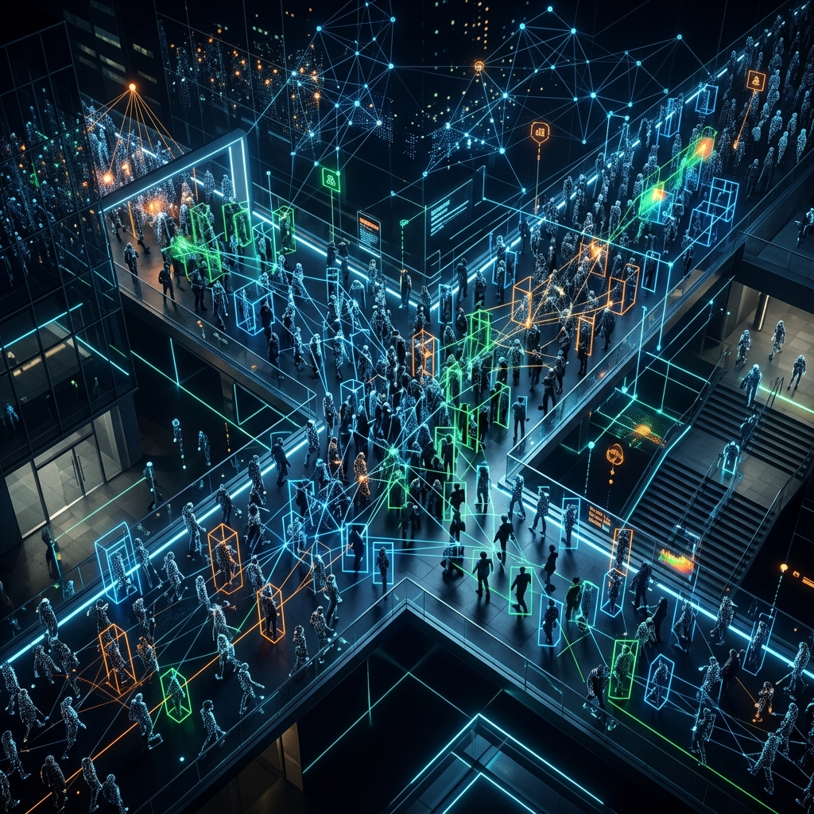
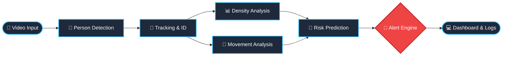
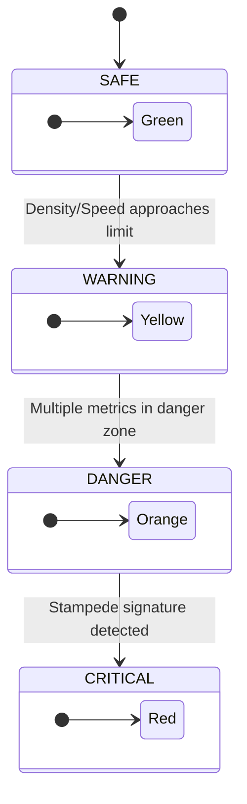

<div align="center">



# 🛡️ CrowdSafe AI
**Intelligent Crowd Safety & Stampede Prevention System**

[](https://www.python.org/)
[](https://github.com/ultralytics/ultralytics)
[](https://pytorch.org/)
[](https://opensource.org/licenses/MIT)

An AI-powered real-time crowd monitoring system that detects people, tracks movement, measures density, predicts dangerous situations, and triggers alerts — **all before a stampede or crowd accident can happen.** Built for real-world deployment at railway stations, temples, stadiums, malls, concerts, and high-footfall public spaces.

</div>

---

## 👁️ What This System Does

Most CCTV systems just record. **This system thinks.**

It watches a crowd in real time, understands what is happening, predicts what is about to happen, and warns the right people with enough time to act. The goal is simple — **prevent crowd accidents before they occur**, not document them after.

### 🔄 Core Processing Pipeline



---

## 📸 Input Sources Supported

- **Webcam** (laptop or USB camera)
- **CCTV / IP Camera feed** (RTSP stream)
- **Pre-recorded video file** (MP4, AVI, etc.)
- **Multiple cameras** simultaneously
- **Drone video feed** (aerial crowd monitoring)

---

## ✨ Feature List

### 🧍 People Detection & Tracking
- **YOLOv8 Engine:** Detects people frame by frame at 30+ FPS.
- **Persistent Tracking:** Assigns a unique ID to each person, storing their movement trajectory and handling partial occlusions.
- **Low-Light Operation:** Works efficiently in dimly lit and highly crowded conditions.

### 🔢 Crowd Counting & Density Analysis
- **Live & Peak Counts:** Tracks total visible people and records peak density.
- **Entry/Exit Counting:** Draws virtual lines to calculate real-time venue occupancy.
- **Zone-Based Density:** The frame is divided into a configurable grid. Each zone gets a risk label, pinpointing exactly where danger is forming.
- **Dynamic Density Tracking:** Detects sudden density spikes and trends.

### 🔥 Heatmap Visualization
- **Density Heatmap:** Overlaid on live feed, color-coded from green (safe) to red (critical).
- **Motion Heatmap:** Shows high-movement areas.
- **Historical Heatmap:** Accumulates data to expose persistent bottlenecks.

### 🏃‍♂️ Movement & Stampede Analysis
- **Speed & Direction:** Calculates individual and crowd speed, detecting sudden surges or reversals.
- **Flow Analysis:** Visualizes movement using flow arrows to detect blocked passages.
- **Stampede Signatures:** Instantly detects danger patterns:
  - *Sudden speed increase*
  - *Crowd compression (distance dropping below safe limits)*
  - *Escape patterns (explosion away from a point)*
  - *Pressure waves*

### 🔮 Predictive Risk Engine (LSTM)
An LSTM neural network trains on the last 60 seconds of metrics to output a **risk forecast for the next 30, 60, and 120 seconds**. It gives operators genuine 1–2 minute advance warnings before visible danger occurs.

### 🚶 Behavior Detection & Anomalies
| Behavior | How It's Detected |
| :--- | :--- |
| **Falling** | Sudden vertical drop, bounding box shifts to horizontal |
| **Running** | Speed far above the crowd average |
| **Loitering** | Person remains stationary longer than a set time |
| **Erratic** | Irregular path, rapid direction changes out of sync |

---

## 🚨 Alert Escalation System



- **Visual Alerts:** Screen overlay changes color, banners appear, zone risk indicators update.
- **Audio Alerts:** Escalating warning tones culminating in a siren.
- **Voice Announcements:** Text-to-speech engine announces conditions (supports regional languages) for PA systems.
- **Notifications:** Instantly sends SMS (Twilio), Emails, and Firebase Push Notifications to security personnel.

---

## 👧 Lost Child Detection
One of the most human and powerful features of CrowdSafe AI. 
The system continuously scans for isolated small figures, children separated from groups, or stationary children while the crowd moves. When a child is alone for too long, the bounding box highlights orange, and nearby guards are notified immediately. *(Optional: Integrates with Face Recognition for missing person tracking).*

---

## 📱 Live Operations Dashboard
A unified Command Center designed for venue managers.
- Annotated live video feed with heatmaps and zones.
- Real-time statistics panel (Density, Occupancy, Speed).
- Color-coded grid map.
- System health (Uptime, FPS, CPU/GPU load).
- Live scrolling incident log.

---

## ⚡ Edge AI Mode (Offline Operation)
CrowdSafe AI doesn't rely on the cloud. It runs entirely on **Edge devices** (Laptops, NVIDIA Jetsons, Raspberry Pi 5).
- No internet connection required for the core pipeline (vital for congested outdoor events).
- YOLOv8 and LSTM models are quantized to ONNX (INT8) for extreme efficiency.
- Processes 30+ FPS locally on modern GPUs.

---

## 📋 Auto-Generated Incident Timelines
When an incident ends, the system instantly compiles a highly detailed, legally defensible incident report.

```text
INCIDENT TIMELINE
─────────────────────────────────────────────────────
12:01:05   Occupancy reached 80% of capacity
12:01:28   Average crowd speed increased 1.8x
12:01:44   Crowd compression detected — Zone C
12:01:45   CRITICAL ALERT — Stampede risk: 94%
12:01:45   Voice announcement triggered
12:02:45   Incident resolved — Duration: 1m 40s
─────────────────────────────────────────────────────
```

---

## 💻 Tech Stack

| Domain | Technology |
| :--- | :--- |
| **AI / Detection** | Python 3.10+, YOLOv8 (Ultralytics), ByteTrack |
| **Deep Learning** | PyTorch, ONNX Runtime |
| **Vision & UI** | OpenCV, Matplotlib, Pygame |
| **Web Dashboard** | FastAPI, React |
| **Audio / Voice** | librosa, PyAudio, pyttsx3 |
| **Notifications** | Twilio, Firebase, SMTP |

---

## ⚙️ Hardware Requirements

- **Minimum:** Any modern laptop, Webcam, 8GB RAM (CPU only, 15-25 FPS).
- **Recommended:** NVIDIA GPU (GTX 1660+), 16GB RAM, HD IP Camera.
- **Production Edge:** NVIDIA Jetson Orin / RTX GPU, multiple RTSP streams, NVMe SSD.

---

## 📜 License

This project is licensed under the **MIT License** — free to use, modify, and distribute with attribution.


---
<br>
<div align="center">
  <a href="https://github.com/kamalesh4044/crowd_detection">
    
  </a>
</div>
